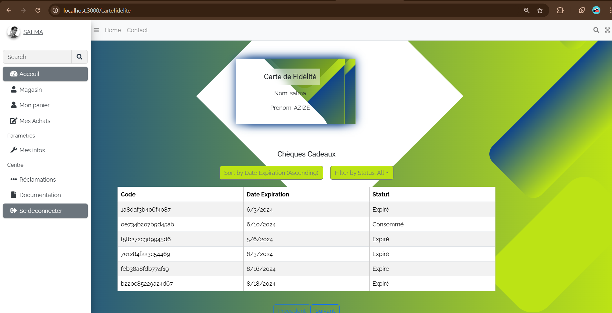
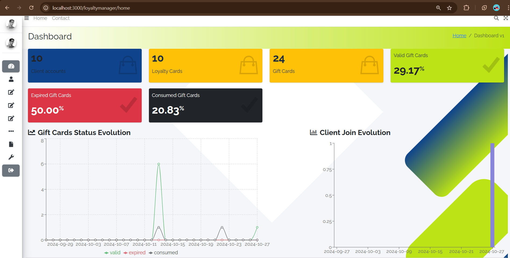
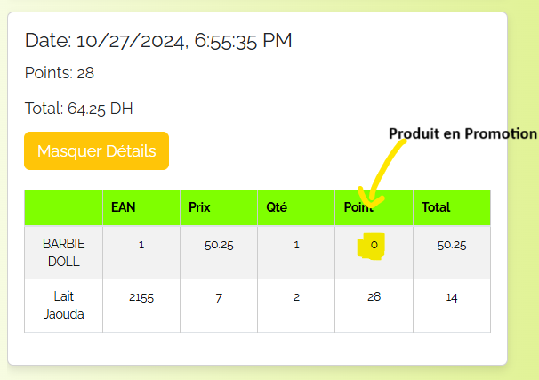
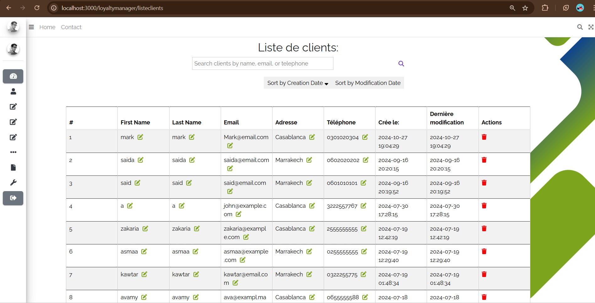
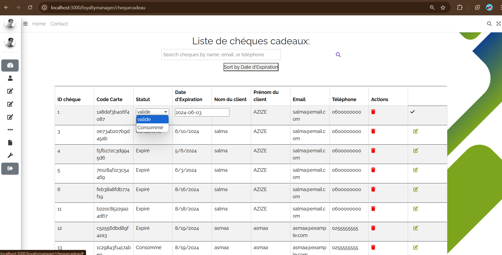
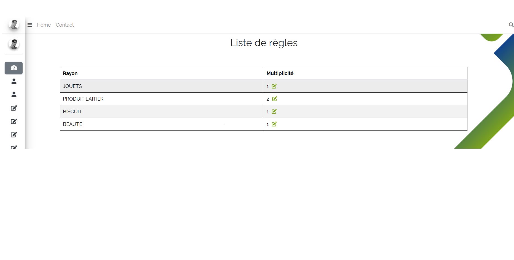

# 📌 Gestion des Points de Fidélité 

Une application **full-stack** de gestion de points de fidélité développée pour un client de **Jolof System**, permettant de récompenser les clients d’un supermarché via des chèques-cadeaux générés automatiquement à partir de leurs transactions.

---

## 🚀 Fonctionnalités clés

### 👥 Côté client
- Suivi du solde de points de fidélité
- Génération et affichage des chèques-cadeaux (valide, expiré, consommé)
- Historique des achats
- Système de réclamations
- Informations personnelles modifiables

### 🛠️ Côté administrateur
- Gestion des clients et de leurs cartes de fidélité
- Suivi des chèques-cadeaux (statuts, création automatique)
- Gestion des règles de conversion des points
- Tableau de bord avec statistiques clés (CA, fidélité)
- Gestion des produits, rayons et promotions

---

## 🧰 Technologies utilisées

- **Front-end** : React.js, Bootstrap, Formik, Yup
- **Back-end** : Node.js, Express.js
- **Base de données** : MySQL
- **Sécurité & Auth** : JsonWebToken, bcrypt
- **Tests API** : Insomnia
- **Outils** : Visual Studio Code, SQL Workbench

---

## 🛠️ Installation & Exécution

> ⚠️ Prérequis : Node.js, npm, MySQL installés

```bash
# 1. Cloner le projet
git clone https://github.com/Salma803/GestionPointsDeFidelite.git
cd GestionPointsDeFidelite

# 2. Démarrer le backend
cd server
npm install
npm start

# 3. Ouvrir un nouveau terminal et démarrer le frontend
cd client
npm install
npm start
```

---

## 📸 Aperçu visuel de l'application

Voici quelques écrans représentatifs des principales fonctionnalités de l'application :

### 🏠 Accueil client
Affiche un résumé du solde de points de fidélité, des chèques-cadeaux actifs, et des options de navigation.


---

### 📊 Dashboard administrateur
Vue globale pour les agents de fidélité ou de magasin, avec statistiques clés (CA, chèques, utilisateurs).


---

### 🧾 Historique d’achats
Liste des transactions passées d’un client, avec filtres pour une consultation rapide.



---

### ⚙️ Gestion des règles ou des clients
Interface pour gérer les utilisateurs, les règles de conversion de points, et les réclamations.





---

## 📦 Structure du projet

```
GestionPointsDeFidelite/
│
│   └── src/
│       ├── components/
│       ├── pages/
│       ├── hooks/
│       └── utils/
│
├── server/               # Application Node.js (Backend)
│   └── middlewares/
│   └── models/
│   └── routes/
│
└── README.md
```

---

## 📈 Objectifs du projet

- Automatiser la gestion des points de fidélité
- Améliorer l’engagement client
- Simplifier la gestion pour les administrateurs
- Fournir des analyses de fidélisation en temps réel

---

## 👩‍💻 Auteur

- Réalisé par : **AZIZE Salma**
